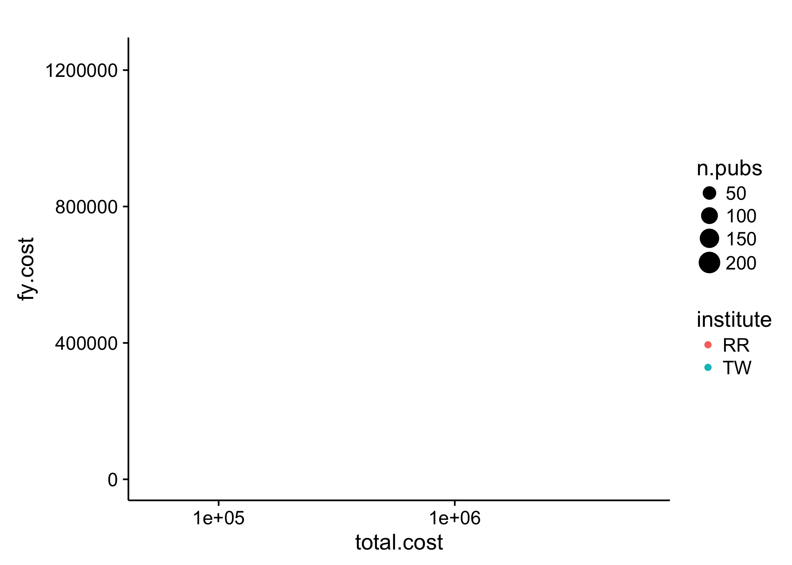

```{r setup, include=FALSE}
knitr::opts_chunk$set(echo = TRUE, comment = "#>")
```

# Submission

1. Fork this repository to your own account
1. Make changes to the `README.Rmd` file (including the author field above).
1. Knit the file to HTML format
1. Publish HTML on Rpubs (you will need to sign up for the free account) and *add the link below*.
1. Submit a PR with your answers.

*Link to Rpubs document:* XXX

# Overview

Take the [datacamp course on joining data](https://www.datacamp.com/courses/joining-data-in-r-with-dplyr) to learn the join verbs.

You will analyze some data in the [`nihexporter`](https://github.com/jayhesselberth/nihexporter) package to answer some questions. The questions will cover methods in `dplyr` including two-table verbs.

First you need to install the `nihexporter` package (and `devtools`, if you don't have it already).

```r
# install.packages('devtools')
devtools::install_github("jayhesselberth/nihexporter")
```

Read the [Overview vignette](http://jayhesselberth.github.io/nihexporter/articles/nihexporter.html) to learn the structure of the pacakge. Take a look at two tables from the package:

```{r overview}
library(nihexporter)
library(tidyverse)
library(broom)

projects
project_io
```

# Problems

## Problem 1

The `projects` and `project_io` tables have the `r intersect(names(projects), names(project_io))` column in common. Use this column to perform a `left_join` and identify the most expensive project for each institute. Project institutes are in the `projects` table, whereas total project costs are available in the `project_io` table. Note you will have to use the `arrange` and `slice` verbs from `dplyr`.


```{r problem_1, eval=FALSE}
dplyr::left_join(projects, project_io, by="project.num") %>% 
  select(project.num, institute, total.cost) %>% 
  group_by(institute) %>% 
  arrange(desc(total.cost)) %>% 
  slice(1:1) %>%
  arrange(desc(total.cost)) -> answer

answer
```


## Problem 2

Create a plot that describes the change in output (number of publications) for the most expensive grant from the above list. Note that you cannot use `n.pubs` for this, as that is an aggregate count over time. You need a tbl of following structure, which you can then use to calculate the number of publications each year (hint: use `n()` in a `summarize` statement:

```{r problem_2}
library(cowplot)

dplyr::left_join(projects, project_io, by="project.num") %>% 
  select(project.num, institute, total.cost) %>% 
  group_by(institute) %>% 
  arrange(desc(total.cost)) %>% 
  slice(1:1) %>%
  arrange(desc(total.cost)) %>%
  ungroup() %>%
  slice(1:1) %>%
  select(project.num) %>%
  left_join(publinks, by ="project.num") %>%
  left_join(publications, by ="pmid") %>%
  select(pub.year, pmid) %>%
  na.omit() -> final.table

# a line graph
final.table %>%
  group_by(pub.year) %>%
  summarise(total.pubs=n()) %>%
  ggplot(aes(x=pub.year, y=total.pubs)) + geom_point() + geom_line() + ylim(0,25) + labs(x = "Year", y = "Number of publications") + theme_classic()

# a bar graph
final.table %>%
  ggplot(aes(factor(pub.year))) + geom_bar() + theme_classic()
```

## Problem 3

Use the `projects` and `clinical_studies` table to calculate how many clinical studies have been started by projects from each institute.

```{r problem_3}
projects %>% 
  select(project.num, institute) %>% 
  inner_join(clinical_studies, by = "project.num") %>% 
  group_by(institute) %>% 
  summarise(total.trials = n_distinct(trial.id)) %>% 
  arrange(desc(total.trials))-> total.trials

total.trials

total.trials %>% 
  ggplot(aes(x=institute, y=total.trials)) + geom_point() + labs(title = "Total number of clinical trials per institute", x = "Institute", y = "Number of clinical trials") + theme_classic()
```


## Problem 4

Calculate correlations between `total.cost` and `n.pubs` for each institute. You will need to `join` the `projects` and `project_io` tables to link `institute` with `total.cost` and `n.pubs`. You will then need to use `group_by` and `do` from `dplyr` and `tidy` from `broom` to calculate correlations.

```{r problem_4, eval=FALSE}
projects %>% 
  left_join(project_io) %>% 
  filter(!duplicated(project.num), !is.na(n.pubs), !is.na(total.cost)) %>%
  select(institute,project.num,fiscal.year, fy.cost, n.pubs, n.patents, total.cost) %>% 
  arrange(institute, project.num) -> tab


tab %>%
  group_by(institute) %>%
  do(tidy(cor(.$n.pubs, .$total.cost))) -> result

result
```


## Problem 5 (extra credit)

Correlate [`rcr`](https://icite.od.nih.gov/) values from the `publications` table to one of:

- total cost (overall for NIH, or by institute)
- budget mechanism (e.g., RFA, PAR, etc.)
- type of grant (e.g. R01, P01, R21, etc.). 

```{r extra_credit}
publinks %>% 
  left_join(publications, by ="pmid") %>% 
  left_join(projects, by ="project.num") %>% 
  select(institute, project.num, activity, pmid, rcr) %>% 
  na.omit() -> rcr.table

rcr.table

rcr.table %>% 
  group_by(activity) %>% 
  summarise(n.pub = n(), median.rcr = median(rcr), mean.rcr = mean(rcr), min.rcr = min(rcr), max.rcr=max(rcr)) %>% 
  rename(grant = activity) %>% 
  arrange(desc(n.pub))

```


## Problem 6 (extra extra credit)

Use [`gganimate`](https://github.com/dgrtwo/gganimate) to illustrate the change in cost of R01s for a few institutes over time.

```{r extra_extra_credit, fig.show = 'animate'}
# devtools::install_github("dgrtwo/gganimate")
library(gganimate)
projects %>% 
  filter(activity == "R01", institute == c("RR", "TW")) %>%
  select(institute, project.num, activity, fiscal.year, project.start, project.end, fy.cost) %>% 
  left_join(project_io, by ="project.num") %>%
  na.omit() %>%
  arrange(institute, fiscal.year) -> tmp 

p <- ggplot(tmp, aes(x= total.cost, y= fy.cost, size = n.pubs, color = institute, frame = fiscal.year)) +
  geom_point() +
  scale_x_log10()

gganimate(p, "animated.gif")
```


